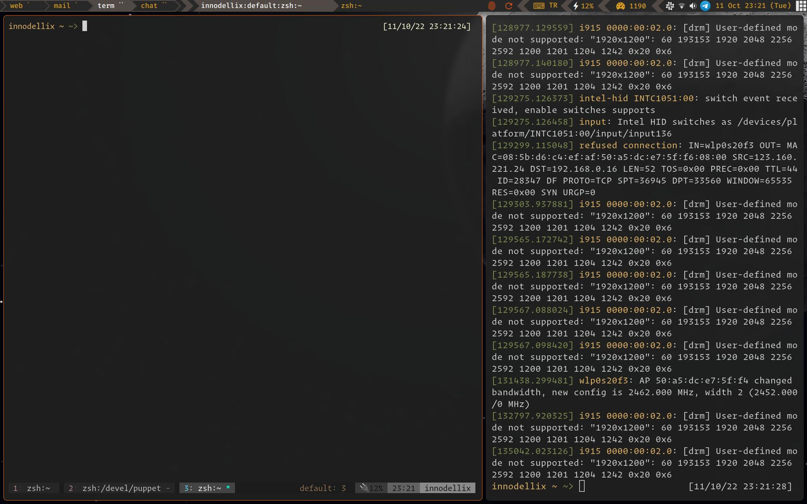

### My AwesomeWM config

This is the reason I'm still not using Wayland. Too good to lose.

Highlights:
- Just 4 permanent tags, no transient crap
- Only 2 active layouts: Tile and Max (default)
- Taglist hints client count by dots, dynamically updated
- Remembers which tags were visible/active on every individual screen after WM (re)start
- Handmade theme
  - Powerline-style wibar
  - Gruvbox colors (for now), different colors hinting the status of all widgets
  - Custom volume/brightness sliders & media notifications
  - Random wallpapers per screen, from given directory
- Multi-monitor support
  - The X display set as "primary" has systray and 2 tags (term & chat) on it
  - Non-primary displays get the web & mail tags (replicated if more screens available)
  - Dynamic re-organisation of tags in case of screen addition/removal (so no clients get lost)
  - If a monitor is widescreen, automatically split into 2 "fake" screens, which you can expand/shrink
- Keyboard oriented
  - Can resize, change tag, move, minimize, even suspend any client via shortcuts
  - Can toggle special "sticky" mode for client
    - Very useful to keep meetings on the corner & on top
    - Can be also toggled to "shy" mode, which makes it semi-transparent and actively escape from mouse
- Useful widgets on wibar
  - Rotate screen toggle (if supported)
  - Touchscreen toggle (if supported)
  - Caps lock warning widget (hidden if caps locks is off)
  - Pressure information widget (Linux PSI)
  - Keyboard layout toggle
  - Interactive Spotify widget (when app is running)

TODO: Add list of all shortcuts

  

